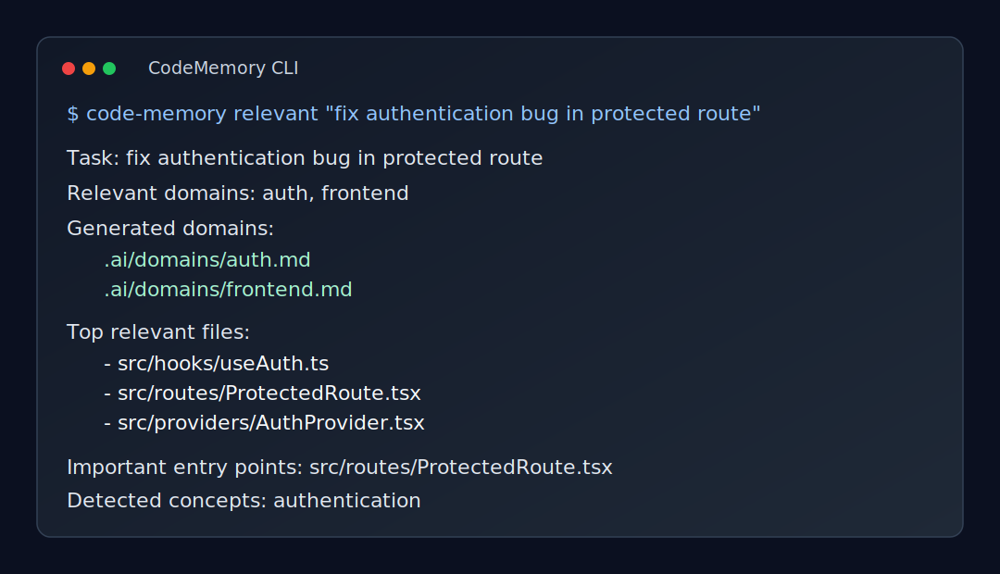

# CodeMemory

CodeMemory is a local-first CLI that creates persistent architecture memory and task-aware context routing for AI coding workflows.

## What It Solves

Coding agents and assistants repeatedly rescan repositories to rebuild context. This creates token waste, latency, and inconsistent task routing.

CodeMemory precomputes deterministic project context artifacts so tools can route quickly to relevant domains and files.

## Why It Exists

- Reduce repeated full-repo scanning
- Improve task-to-code routing quality
- Keep context generation deterministic and auditable
- Work offline and locally without cloud dependencies

## Installation

### Requirements

- Node.js 20+
- pnpm 10+

## Global Installation

```bash
npm install -g code-memory-cli
```

Then:

```bash
code-memory --help
code-memory init
code-memory analyze
code-memory relevant "fix authentication bug"
```

### Local Development

```bash
pnpm install
pnpm build
```

Run the CLI in workspace mode:

```bash
pnpm --filter code-memory-cli dev init
```

## Commands

```bash
code-memory init
code-memory analyze
code-memory update
code-memory relevant "fix authentication bug"
```

## Generated Structure (example)

```txt
.ai/
├── project-context.md
├── context-index.json
├── context-state.json
├── dependency-graph.json
└── domains/
    ├── auth.md
    ├── frontend.md
    ├── backend.md
    └── payments.md
```

Domain files are generated heuristically from your repository signals, so names and counts will vary by project.

## Current Stack Support

- React
- Vite
- Node.js
- Express
- NestJS
- Supabase
- Laravel/PHP
- Python
- FastAPI
- Django
- Docker

(Currently heuristic-based and evolving.)

### `code-memory init`

Scans the repository and generates baseline context artifacts:

- `.ai/project-context.md`
- `.ai/context-index.json`
- `.ai/context-state.json`
- `.ai/dependency-graph.json`

### `code-memory analyze`

Infers domains and writes domain summaries:

- `.ai/domains/*.md`

### `code-memory update`

Uses git changes + stored state to refresh only what changed:

- Updates context artifacts
- Regenerates affected domain files
- Prints `Context already up to date` when no meaningful changes exist

### `code-memory relevant "<task>"`

Returns compact, high-signal routing output:

- relevant domains
- top relevant files
- important entry points
- detected concepts

## Polished CLI Example

```bash
code-memory relevant "fix authentication bug in protected route"
```

Example output:

```txt
Task: fix authentication bug in protected route
Relevant domains: auth, frontend
Top relevant files:
- src/hooks/useAuth.ts
- src/routes/ProtectedRoute.tsx
- src/providers/AuthProvider.tsx
Important entry points:
- src/routes/ProtectedRoute.tsx
- src/pages/login.tsx
Detected concepts:
- authentication
```

## Screenshot



## Architecture Overview

CodeMemory currently ships as a pnpm monorepo:

- `packages/core`
: deterministic scanner, detector, domain inference, dependency graph, and relevance logic
- `packages/cli`
: command-line interface built with commander

Primary artifact flow:

1. Scan repository files
2. Detect project signals and stacks
3. Build context index and dependency graph
4. Infer domains using weighted deterministic rules
5. Route task relevance from generated artifacts

## Limitations (Current MVP)

- Regex-based import extraction only (no AST parsing)
- Deterministic heuristics may miss project-specific conventions
- No embeddings, semantic vector search, or LLM-based ranking
- No IDE extension or cloud sync yet

## Roadmap

- Smarter rule-pack extensibility per ecosystem
- Configurable domain packs
- Optional AST-powered import graph
- Better monorepo workspace segmentation
- Optional editor integration

## Examples

Additional outputs and release screenshots/examples are in:

- `examples/`
